# openCX-*BitX* Development Report

Welcome to the documentation pages of the **BitX** of **openCX**!

You can find here detailed information about the (sub)product, hereby mentioned as module, from a high-level vision to low-level implementation decisions, a kind of Software Development Report (see [template](https://github.com/softeng-feup/open-cx/blob/master/docs/templates/Development-Report.md)), organized by discipline (as of RUP): 

* Business modeling 
  * [Product Vision](#Product-Vision)
  * [Elevator Pitch](#Elevator-Pitch)
* Requirements
  * [Use Case Diagram](#Use-case-diagram)
  * [User stories](#User-stories)
  * [Domain model](#Domain-model)
* Architecture and Design
  * [Logical architecture](#Logical-architecture)
  * [Physical architecture](#Physical-architecture)
  * [Prototype](#Prototype)
* [Implementation](#Implementation)
* [Test](#Test)
* [Configuration and change management](#Configuration-and-change-management)
* [Project management](#Project-management)

So far, contributions are exclusively made by the initial team, but we hope to open them to the community, in all areas and topics: requirements, technologies, development, experimentation, testing, etc.

Please contact us! 

Thank you!

João Praça 
Leonor Sousa 
Lucas Ribeiro 
Sílvia Rocha 

## Product Vision
Creating a product that improves the user experience in the check-in process.

## Elevator Pitch
Tired of wainting in infinite queues just to make a simple check-in? 
Tired of having that check-in made by ordinary people? 
Here in Bitx, We have the perfect solution for you: BotX! All you have to do is have your bluetooth on and as soon as you reach the place of the event, the check-in will be made automatically for you. You will then receive a QR-code with wich you can collect your welcome kit.  
But that isn't enough, is it?  
Well, if you are one of the lucky ones, you will be rewarded with a special surprise: BotX, our genial robot will be the one delivering the welcome kit to you. 
Are you ready for the best check-in of your life?! 

## Requirements

Our product will result in two subproducts that interact with each other: the automatic check-in (provided by the app and beacon working together) and, for some of the users, a robot that will deliver the welcome kit.

For this, we need to build a app that fulfills some requirements
* Has the login and the logout functionalitys
* Informs the user to turn on the bluetooth
* Has a help page to inform the user on how the product works
* Informs the user when the check-in was completed
* Gives the user a QR-code so he can collect the welcome kit, if he was not selected
* Gives the user the information that he was selected to receive the kit by the robot

The server must be able to fulfill some other requirements:
* Comunicate with the robot, in order to send it to the selected user
* Generate and save the QR-codes generated
* Save information on wich QR-codes have already been read (so the same user isn't able to collect more than one welcome kit)

The robot must fulfill the following requirements:
* Meet the user (using the beacon to find out its location)
* Able to read the QR-code of the user
* Only give the kit to the user if the QR-code is valid

### Use case diagram 

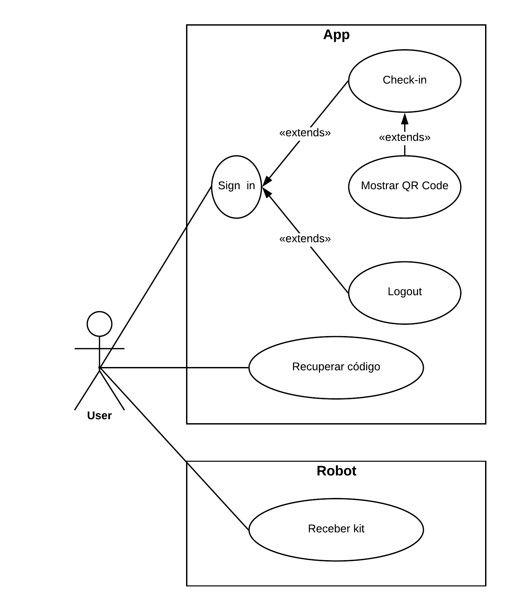

* The user can do the login, as long as he is logged out. To do the login, the user only needs to insert the code he received when he bought the ticket. If the user inserts a valid code, he will be redirected to another page, depending on the state of his check-in. If the user inserts an invalid code, he shall remain in the same page, receiving a message that the code was invalid. 

* The user can do the automatic check-in, as long as he is logged in, his bluetooth is on and he is on the perimeter of the beacon. If all the preconditions are satisfied, the check-in will be done sucessfully, and the server will generate a random number in order to decide whether the user is selected or not for the robot experience. The user will then be redirected to a page containing the QR-code and a message telling him if he was selected or not. If the user isn't logged in, than he will be in the page for the login. If the user's bluetooth is off, he will be in a page telling him to turn the bluetooth on. If the user isn't in the perimeter of the beacon, he will be in a page telling him the check-in still hasn't been completed. These three alternative flows, happen in the presented order.

* The user must be shown a QR-code, once he has completed the check-in. If the check-in isn't completed, another page will be shown, as explained in the precious use case.

* The user can do the logout, as long as he is logged in. Once he does it, he will be redirected to the login page.

* The user can ask to recover the code of the register. For that he must click on the option "Recover Password" on the log in page, wich will redirect him to the recover password page. To recover the password, the user must enter his email. If the email is registered in the server, a message will be shown telling him that an email was sent with the code and he will be redirected to the login page. If the email is not registered, a messege will be shown telling him so.

* The user can receive the kit by the robot, as long as he shows the robot his QR-code and it's the first time he as done so.

In any of this use cases, if there is a problem communicating with the server (example: checking for the valid code in the login, generating the QR-code, registering the check-in, etc.), the user should be redirected to a page informing him there has been an error and asking him to go the help center.

### User stories

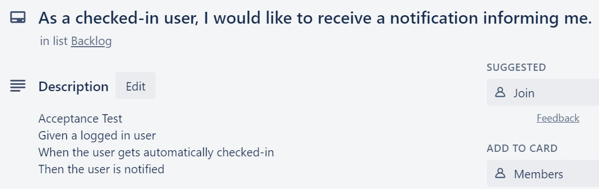
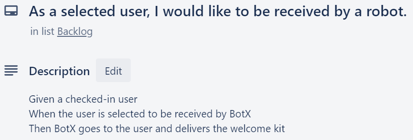
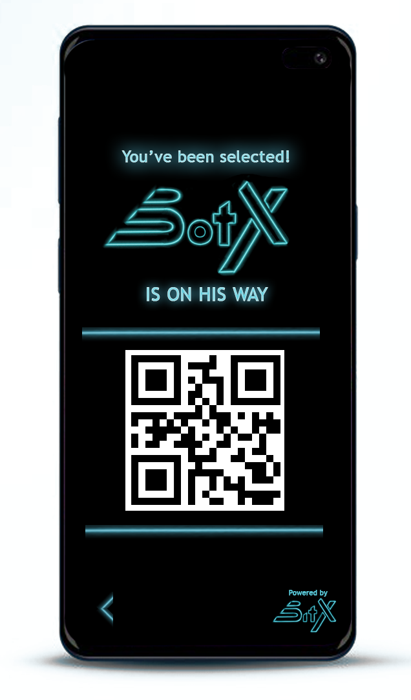
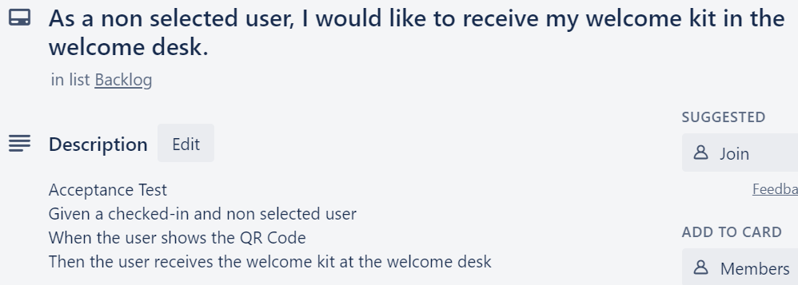
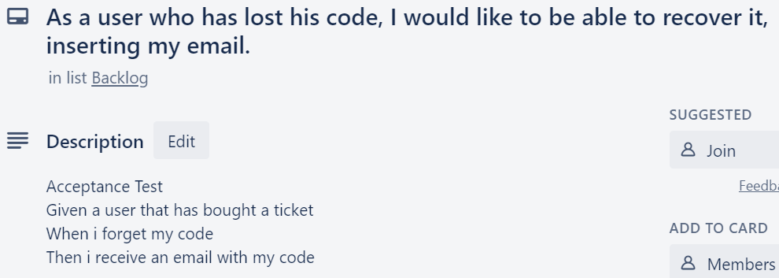
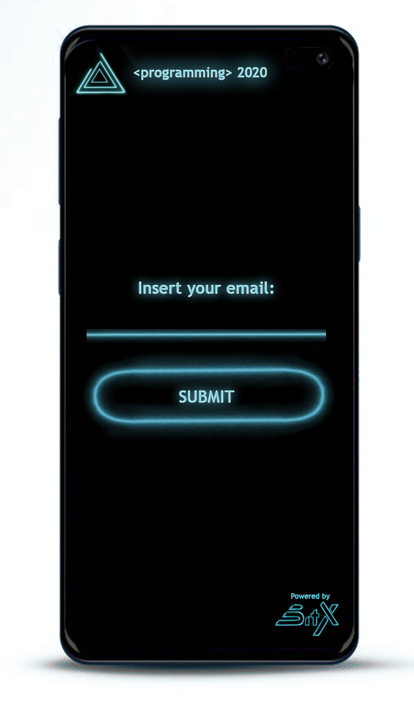
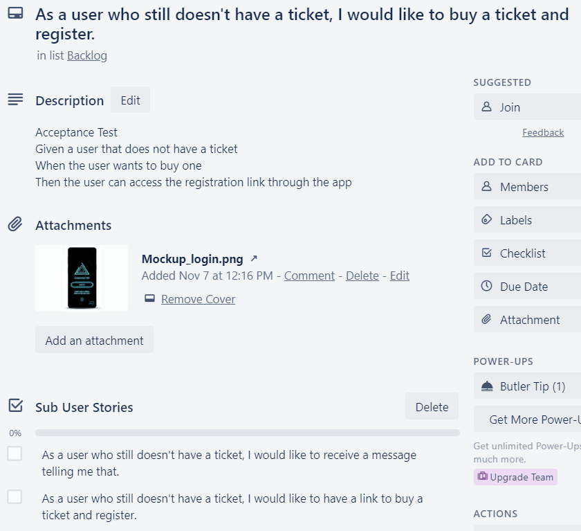
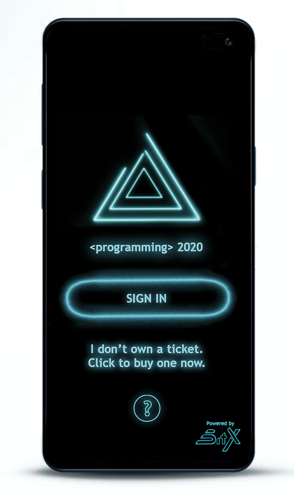
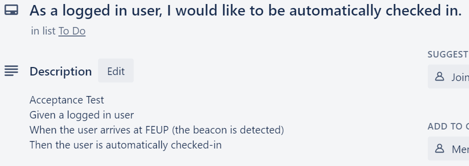
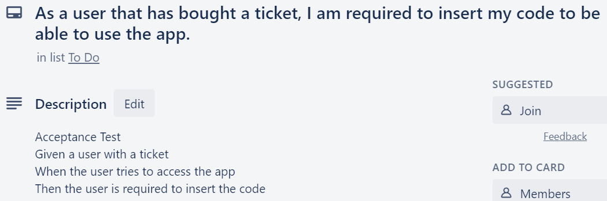
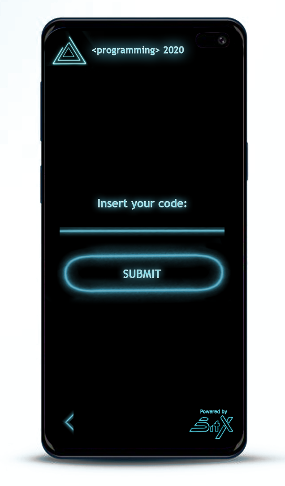
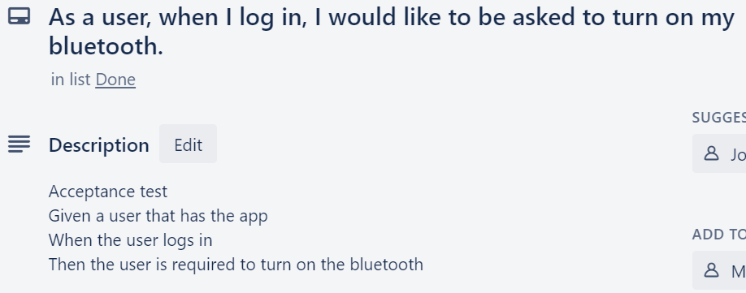
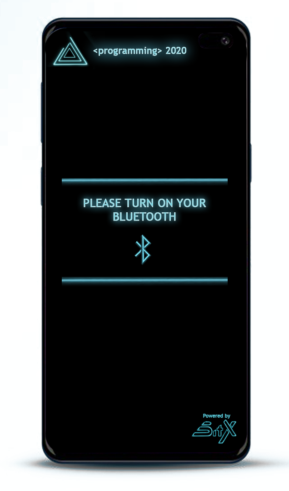
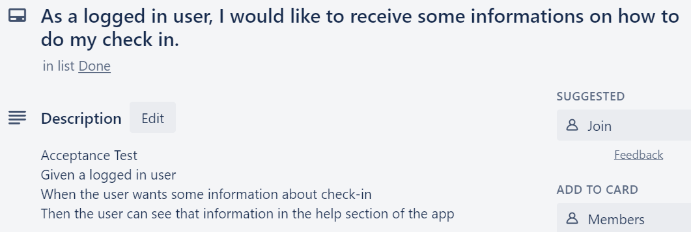
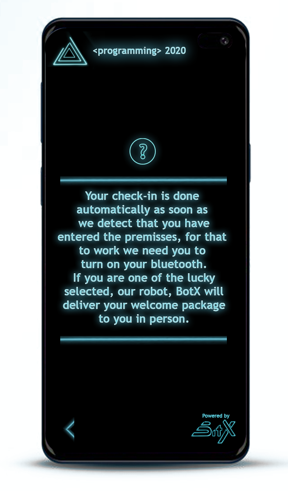

### Domain model

A simple UML class diagram with all the key concepts (names, attributes) and relationships involved of the problem domain addressed by your module.

---

## Architecture and Design
The architecture of a software system encompasses the set of key decisions about its overall organization. 

A well written architecture document is brief but reduces the amount of time it takes new programmers to a project to understand the code to feel able to make modifications and enhancements.

To document the architecture requires describing the decomposition of the system in their parts (high-level components) and the key behaviors and collaborations between them. 

In this section you should start by briefly describing the overall components of the project and their interrelations. You should also describe how you solved typical problems you may have encountered, pointing to well-known architectural and design patterns, if applicable.

### Logical architecture
The purpose of this subsection is to document the high-level logical structure of the code, using a UML diagram with logical packages, without the worry of allocating to components, processes or machines.

It can be beneficial to present the system both in a horizontal or vertical decomposition:
* horizontal decomposition may define layers and implementation concepts, such as the user interface, business logic and concepts; 
* vertical decomposition can define a hierarchy of subsystems that cover all layers of implementation.

### Physical architecture
The goal of this subsection is to document the high-level physical structure of the software system (machines, connections, software components installed, and their dependencies) using UML deployment diagrams or component diagrams (separate or integrated), showing the physical structure of the system.

It should describe also the technologies considered and justify the selections made. Examples of technologies relevant for openCX are, for example, frameworks for mobile applications (Flutter vs ReactNative vs ...), languages to program with microbit, and communication with things (beacons, sensors, etc.).

### Prototype
To help on validating all the architectural, design and technological decisions made, we usually implement a vertical prototype, a thin vertical slice of the system.

In this subsection please describe in more detail which, and how, user(s) story(ies) were implemented.

---

## Implementation
Regular product increments are a good practice of product management. 

While not necessary, sometimes it might be useful to explain a few aspects of the code that have the greatest potential to confuse software engineers about how it works. Since the code should speak by itself, try to keep this section as short and simple as possible.

Use cross-links to the code repository and only embed real fragments of code when strictly needed, since they tend to become outdated very soon.

---
## Test

There are several ways of documenting testing activities, and quality assurance in general, being the most common: a strategy, a plan, test case specifications, and test checklists.

In this section it is only expected to include the following:
* test plan describing the list of features to be tested and the testing methods and tools;
* test case specifications to verify the functionalities, using unit tests and acceptance tests.
 
A good practice is to simplify this, avoiding repetitions, and automating the testing actions as much as possible.

---
## Configuration and change management

Configuration and change management are key activities to control change to, and maintain the integrity of, a project’s artifacts (code, models, documents).

For the purpose of ESOF, we will use a very simple approach, just to manage feature requests, bug fixes, and improvements, using GitHub issues and following the [GitHub flow](https://guides.github.com/introduction/flow/).

---

## Project management

For project management, our group is using Trello. You can find our Trello board in the following link: https://trello.com/invite/b/8T9XmeIY/820dd8f2fab87c8ef924e8e77fc6bda1/botx
