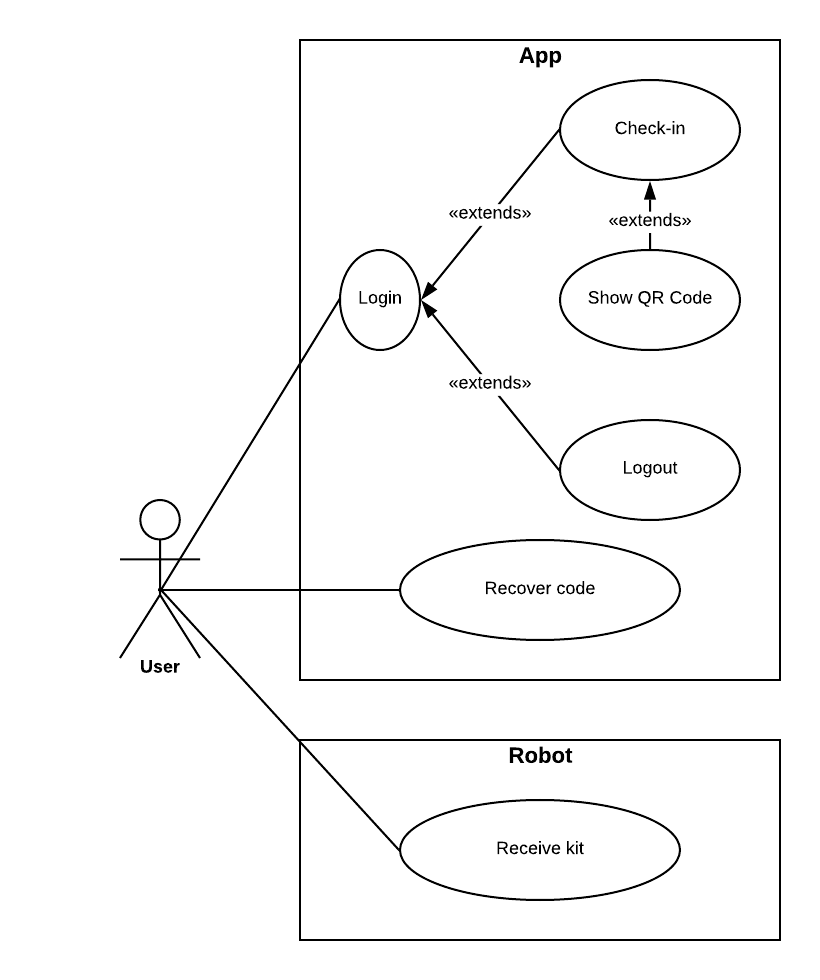
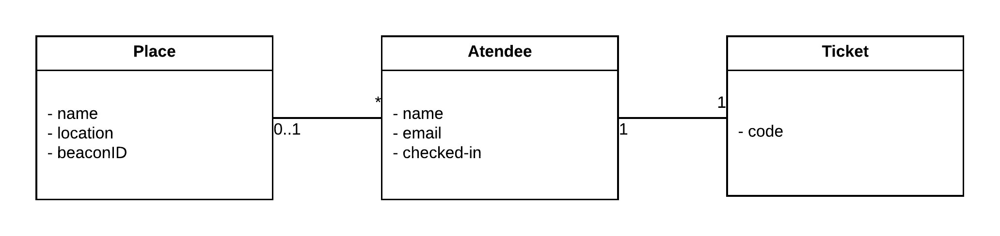

# openCX-*BitX* Development Report

Welcome to the documentation pages of the **BitX** of **openCX**!

You can find here detailed information about the (sub)product, hereby mentioned as module, from a high-level vision to low-level implementation decisions, a kind of Software Development Report (see [template](https://github.com/softeng-feup/open-cx/blob/master/docs/templates/Development-Report.md)), organized by discipline (as of RUP): 

* Business modeling 
  * [Product Vision](#Product-Vision)
  * [Elevator Pitch](#Elevator-Pitch)
* Requirements
  * [Use Case Diagram](#Use-case-diagram)
  * [User stories](#User-stories)
  * [Domain model](#Domain-model)
* Architecture and Design
  * [Logical architecture](#Logical-architecture)
  * [Physical architecture](#Physical-architecture)
  * [Prototype](#Prototype)
* [Implementation](#Implementation)
* [Test](#Test)
* [Configuration and change management](#Configuration-and-change-management)
* [Project management](#Project-management)

So far, contributions are exclusively made by the initial team, but we hope to open them to the community, in all areas and topics: requirements, technologies, development, experimentation, testing, etc.

Please contact us! 

Thank you!

João Praça 
Leonor Sousa 
Lucas Ribeiro 
Sílvia Rocha 

## Product Vision
Creating a product that improves the user experience in the check-in process.

## Elevator Pitch
Tired of waiting in infinite lines just to make a simple check-in? 
Tired of having that check-in made by ordinary people? 
Here in Bitx, We have the perfect solution for you: BotX! All you have to do is have your bluetooth on and as soon as you reach the place of the event, the check-in will be made automatically for you. You will then receive a QR-code with which you can collect your welcome kit.  
But that isn't enough, is it?  
Well, if you are one of the lucky ones, you will be rewarded with a special surprise: BotX, our genial robot will be the one delivering the welcome kit to you. 
Are you ready for the best check-in of your life?! 

## Requirements

Our product will result in two subproducts that interact with each other: the automatic check-in (provided by the app and beacon working together) and, for some of the users, a robot that will deliver the welcome kit.

For this, we need to build an app that fulfills some requirements
* Has the login and the logout functionalitys
* Informs the user to turn on the bluetooth
* Has an help page to inform the user on how the product works
* Informs the user when the check-in was completed
* Gives the user a QR-code so he can collect the welcome kit, if he was not selected
* Gives the user the information that he was selected to receive the kit by the robot

The server must be able to fulfill some other requirements:
* Comunicate with the robot, in order to send it to the selected user
* Generate and save the QR-codes generated
* Save information on which QR-codes have already been read (so the same user isn't able to collect more than one welcome kit)

The robot must fulfill the following requirements:
* Meet the user (using the beacon to find out its location)
* Able to read the QR-code of the user
* Only give the kit to the user if the QR-code is valid

## Use case diagram 

### Sign In

**Actor:** Atendee and conference participant

**Description:** To do the login, the user only needs to insert the code he received when he bought the ticket. 

**Preconditions and Postconditions:** The user must be logged out, own a ticket and have his code ready to be inserted.

**Normal Flow:**
* User selects the sign in option in the main screen
* User inputs the ticket code in the respective field
* User is logged in

**Alternative Flows and Exceptions:** 
* If the user enters any invalid input he will not be logged in and will be asked to fill in the code correctly.
*If the user does not remember his code, he will access the recover code screen 

 

### Check-in

**Actor:** Atendee and conference participant

**Description:** The user is automatically checked in by arriving at FEUP 

**Preconditions and Postconditions:** A beacon must be instaled in FEUP's entry. The user must be logged in and have his bluetooth turned on so the beacon can be detected.

**Normal Flow:**
* User is logged in
* User turns on bluetooth
* User arrives at FEUP
* User is checked in
* User is notified

**Alternative Flows and Exceptions:** 
* If the user isn't logged in, than he will be in the page for the login. 
* If the user's bluetooth is off, he will not be checked in and will be asked to turn on the bluetooth. 
* If the user isn't in the perimeter of the beacon, he will be in a page telling him the check-in still hasn't been completed. 

 

### Show QR Code

**Actor:** Atendee and conference participant

**Description:** The user shows his QR Code to the robot or at the welcome desk and receives his goodies bag

**Preconditions and Postconditions:** Being checked in and having the QR Code

**Normal Flow:**
* User is checked in
* User has the QR Code
* User shows the QR Code
* User receives gift bag

**Alternative Flows and Exceptions:** 
* If the check-in isn't completed, another page will be shown 

 

### Logout

**Actor:** Atendee and conference participant

**Description:** The user shows his QR Code to the robot or at the welcome desk and receives his goodies bag

**Preconditions and Postconditions:** Being checked in and having the QR Code

**Normal Flow:**
* User is signed in
* User presses logout button
* User is logged out

**Alternative Flows and Exceptions:** 
* If the user isn't signed in then we won't have a button to sign out

 

### Recover Code

**Actor:** Atendee and conference participant

**Description:** When a user does not have his ticket code he can recover it by email

**Preconditions and Postconditions:** Having a ticket

**Normal Flow:**
* User has a ticket
* User wants to login but doesn't remember code
* User opens recovery screen
* User gives his email
* User receives email with password recovery option

**Alternative Flows and Exceptions:** 
* If the user doesn't have a ticket or inputs a invalid email he will be told so and will have to input a valid email 

 

### Receive Kit

**Actor:** Atendee and conference participant

**Description:** If the user is one of the selected ones he will receive is gift bag by a robot

**Preconditions and Postconditions:** Being checked in and having the QR Code

**Normal Flow:**
* User is checked in
* User is one of the selected ones
* User has the QR Code
* User shows the QR Code to the robot
* User receives gift bag

 

**Alternative Flows and Exceptions:** 
* If the check-in isn't completed, another page will be shown 
* If the user isn't one of the selected ones he should go to the welcome desk to receive his bag

In any of this use cases, if there is a problem communicating with the server (example: checking for the valid code in the login, generating the QR-code, registering the check-in, etc.), the user should be redirected to a page informing him there has been an error and asking him to go the help center.

 

## User stories

> 1 - As a checked-in user, I would like to receive a notification informing me the check-in is done.

**Acceptance Test:**  
&nbsp;&nbsp;&nbsp;Given a logged in user  
&nbsp;&nbsp;&nbsp;When the user gets automatically checked-in  
&nbsp;&nbsp;&nbsp;Then the user is notified  

**Value:** Can Have  
**Effort:** M  

> 2 - As a selected user, I would like to be received by a robot.

**Acceptance Test:**  
&nbsp;&nbsp;&nbsp;Given a checked-in user 
&nbsp;&nbsp;&nbsp;When the user is selected to be received by BotX  
&nbsp;&nbsp;&nbsp;Then BotX goes to the user and delivers the welcome kit  

**Value:** Shall Have  
**Effort:** L  

> 3 - As a non selected user, I would like to receive my welcome kit in the welcome desk.

**Acceptance Test:**  
&nbsp;&nbsp;&nbsp;Given a checked-in and non selected user 
&nbsp;&nbsp;&nbsp;When the user shows the QR Code  
&nbsp;&nbsp;&nbsp;Then the user receives the welcome kit at the welcome desk  

**Value:** Shall Have  
**Effort:** M  

> 4 - As a user who has lost his code, I would like to be able to recover it, inserting my email.

**Acceptance Test:**  
&nbsp;&nbsp;&nbsp;Given a user that has bought a ticket 
&nbsp;&nbsp;&nbsp;When the user forgets its code  
&nbsp;&nbsp;&nbsp;Then the user receives an email with its code  

**Value:** Shall Have  
**Effort:** M  

> 5 - As a user who still doesn't have a ticket, I would like to buy a ticket and register.

**Acceptance Test:**  
&nbsp;&nbsp;&nbsp;Given a user that does not have a ticket 
&nbsp;&nbsp;&nbsp;When the user opens the app  
&nbsp;&nbsp;&nbsp;Then the user can access the registration link through the app  

**Value:** Can Have  
**Effort:** M  

> 6 - As a logged in user, I would like to be automatically checked in.

**Acceptance Test:**  
&nbsp;&nbsp;&nbsp;Given a logged in user 
&nbsp;&nbsp;&nbsp;When the user arrives at FEUP (the beacon is detected)  
&nbsp;&nbsp;&nbsp;Then the user is automatically checked-in  

**Value:** Must Have  
**Effort:** XL  

> 7 - As a user that has bought a ticket, I am required to insert my code to be able to use the app.

**Acceptance Test:**  
&nbsp;&nbsp;&nbsp;Given a user with a ticket 
&nbsp;&nbsp;&nbsp;When the user tries to access the check-in  
&nbsp;&nbsp;&nbsp;Then the user is required to insert the code  
&nbsp;&nbsp;&nbsp;And the user should be redirected to the beacon interaction screen  

**Value:** Must Have  
**Effort:** L  

> 8 - As a user, when I log in, I would like to be asked to turn on my bluetooth.

**Acceptance Test:**  
&nbsp;&nbsp;&nbsp;Given a user that has a ticket 
&nbsp;&nbsp;&nbsp;When the user logs in  
&nbsp;&nbsp;&nbsp;Then the user is required to turn on the bluetooth  

**Value:** Must Have  
**Effort:** M  

> 9 - As a logged in user, I would like to receive some informations on how to do my check in.

**Acceptance Test:**  
&nbsp;&nbsp;&nbsp;Given a user that has the app 
&nbsp;&nbsp;&nbsp;When the user wants to know some information about the check-in  
&nbsp;&nbsp;&nbsp;Then the user can see that information in the help section of the app  

**Value:** Can Have  
**Effort:** S  

### Domain model

---

## Architecture and Design

The architecture of a software system encompasses the set of key decisions about its overall organization. 

A well written architecture document is brief but reduces the amount of time it takes new programmers to a project to understand the code to feel able to make modifications and enhancements.

To document the architecture requires describing the decomposition of the system in their parts (high-level components) and the key behaviors and collaborations between them. 

In this section you should start by briefly describing the overall components of the project and their interrelations. You should also describe how you solved typical problems you may have encountered, pointing to well-known architectural and design patterns, if applicable.

### Logical architecture

The purpose of this subsection is to document the high-level logical structure of the code, using a UML diagram with logical packages, without the worry of allocating to components, processes or machines.

It can be beneficial to present the system both in a horizontal or vertical decomposition:
* horizontal decomposition may define layers and implementation concepts, such as the user interface, business logic and concepts; 
* vertical decomposition can define a hierarchy of subsystems that cover all layers of implementation.

### Physical architecture

For this software system we developed a mobile application that interacts with a beacon and a robot. 

For the frontend development of this application we used Flutter. This choice was based on two considerations. The first is that on an open source project having a standardize language is important. The second is that this is a frequently used framework in the community so we were able to find a lot of third-party packages and support. One of those packages was used to interact with the bluetooth and the beacon itself. The beacon interaction package simply looks for a certain beacon in the range area. The robot related feature was not implemented inside this project because we considered that the two main components of interaction (robot and backend) were out of our scope as they were already being developed by other groups.

### Prototype

At this initial point, our main focus was to **plan** the project, **prepare** the process and **structure** our app.

At first, we started by searching for the most suitable programming language for our project, and between our two final options, React Native or **Flutter**, the latter was the chosen one.

The next step was to find a way to detect if the user had arrived at the conference, so we investigated and found **beacons** to be the best choice.

As another group was also working with a **robot**, we decided from this point that we would join forces and aimed to connect both projects in the future to create a better experience for the atendees.

Finally, we started creating most of the **mockups** for the app's main screens (one screen per user story), which were then refined and finished in Iteration 1.

---

## Implementation

### Product Increment #1

In this increment the planning phase was concluded with the help of a project management tool (Trello).
* Categorization of each feature by effort and value for the project
* Research about Scrum Methods 
* Division of features into iterations, organizing them by value
* Creation of the backlog and to do lists
* Refinement of the user stories and use cases
* Choosing of the programming language best suited for the project

### Product Increment #2 

In this increment we started the execution and the monitoring and control phases of the project.

* We implemented a status report politic where all elements of the group had to report the evolution of their tasks every few days
* Started the mobile application structure
* Created most of the screens of our application (visual component)
* Research about how beacons work and what packages were available for their integration with flutter

### Product Increment #3

In this increment we dedicated our efforts into the logic behind the screens. 
We decided not to implement the backend component for our application given that some of our features where common with a lot of other groups (login, password recovery, among others) so we thought it made sense to focus our efforts in the exclusive feature that our application presented: the automatic check-in through beacon detection.

* Implementation of the beacon detection 
* Implementation of a primitive version of the bluetooth detection
* Code cleanup inside each screen
* Improvement of the screens' layout
* Improvement of the application's navigation
* Added correct behavior after the beacon detection

### Product Increment #4
At this point, our main focus was to organize the code and guarantee that all main features where correctly implemented.

* Implemented a better version of the bluetooth detection 
* Refined beacon detection and the behavior afterwards
* Implemented QR Code Generator
* Implemented local notifications to inform the user when the check in is completed
* Created functions to verify input in login and recover code screens. In the login screen the user only has to insert something for it to work (without a backend we did not have a way to verify if the code is valid). In the recover code input the user must insert teste@gmail.com for it to recognize it as a valid email (again with no backend there wasn't a way to know if there was actually an account with that email)
* Refactor of the code to divide it in the correct packages (done after the deadline for the increment #4 so it does not appear inside the iteration_4 release)
* Report Improvements

   
All the increments described above can also be checked out [here](https://github.com/softeng-feup/open-cx-bitx/releases)

---
## Test

### Test Plan

We consider the testing phase a really important one. Given that, we plan to test all the features that we intend to implement:
* Automatic Check In
* Help
* Login
* Notifications
* Code Recovery
* Ticket Acquisition
* Bluetooth detection

Of this features, we have already implemented gherkin tests for the login, code recovery, help and ticket acquisition.

###  Test Case Specifications

* test case specifications to verify the functionalities, using unit tests and acceptance tests.

---
## Configuration and change management

For the configuration and change management we planned a simple approach for our project. We tried to follow the github flow by using tags and releases for each iteration. 

In retrospective, we wished we had realized the value of branches and pull requests earlier. We now understand that they are important to guarantee control and maintain the integrity of the project. 

However, the fact that we are now (in iteration #5) working with those tools is really useful so that we can learn more from this and apply it to future projects.

---

## Project management

For project management, our group is using Trello. You can find our Trello board in the following link: https://trello.com/invite/b/8T9XmeIY/820dd8f2fab87c8ef924e8e77fc6bda1/botx

---

## Evolution - contributions to open-cx

In iteration #5 we were assigned an open issue in the open-cx project. This issue consists in creating a button for the participant to be able to click and be checked in.  
For this issue we developed the following:
* Bottom Tab Navigation (the menu mentioned in the slides provided didn't exist yet)
* Button for check in
* Integration of the QR Code Generator so that the user can receive their goodies
* QR Code Scanner so the people that deliver the goodie bags can confirm if that participant has already received a goodie bag or not (this scanner was also integrated in the helpScreen because we had no indication if this scanner were to be used inside the app but with an admin account or if it will be a standalone application)
* Changed the participant model to include two booleans: one to check if the user is checked in and another to check if the user has received the gift bag
* Implemented the corresponding backend (to check in the user, verify if the user is checked in, say that the participant has received the goodie bag and check if the user has already received the bag)

The backend feature could not be tested because we were not able to connect with mongoDB. Given that, (and to guarantee that the frontend could run without errors) we decided to comment the backend calls made by the frontend.
